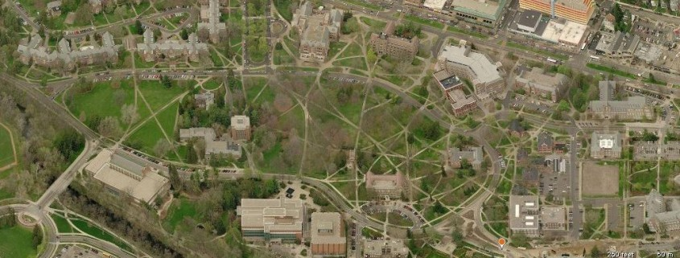
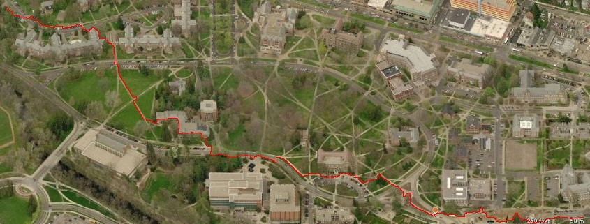

# Image Path Detection

This project detects and highlights a desire path in an image using OpenCV and Streamlit.

## Requirements

- Python 3.x
- OpenCV
- Streamlit

## Installation

1. Clone the repository:
    ```sh
    git clone <repository-url>
    cd <repository-directory>
    ```

2. Install the required packages:
    ```sh
    pip install -r requirements.txt
    ```

## Usage

1. Run the application:
    ```sh
    streamlit run app.py
    ```

2. Upload an image to detect and highlight the desired path.

## Code Overview

The main logic is implemented in [app.py](app.py). The key steps are:

1. Convert the image to grayscale.
2. Apply Gaussian Blur to reduce noise.
3. Perform edge detection using the Canny algorithm.
4. Use the A* search algorithm to find the path.
5. Highlight the detected path in red on the processed image.
6. Display the original and processed images side by side using Streamlit.

## Example

Below are examples of the original and processed images:




Original image source: [Information Research](https://informationr.net/ir/24-4/colis/colis1911.html)